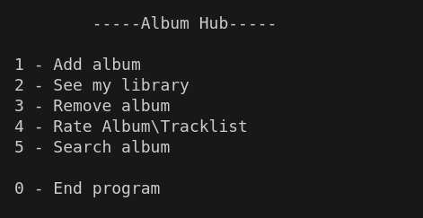
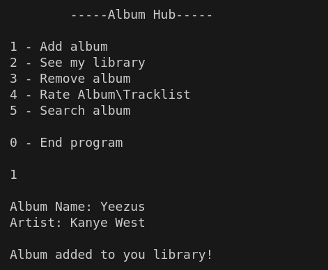
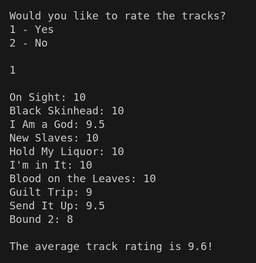
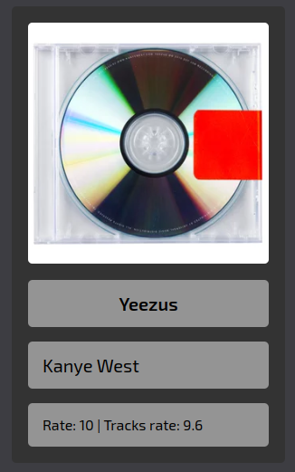
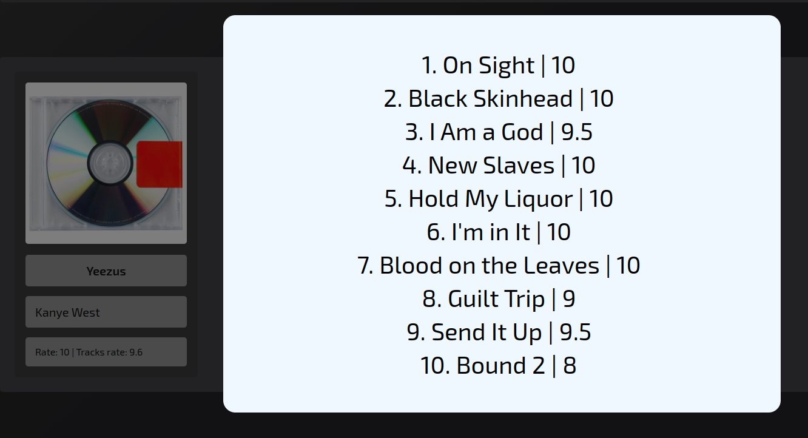

# Album Hub

Album Hub is a personal album library where the user can rate them and their tracks

#### Technologies involved:
 - The back-end is made by JavaScript, JSON, Node.js, making use of the LastFM API
 - The front-end is made by HTML, CSS and JavaScript, also making use of the LastFM API

<br>

# How to use it?

### What do you need:
  
  - Node.js (required for execution) and npm (required for installing modules)
  ```
    sudo apt install nodejs npm
  ```
  - Node.js modules: fs and readline (required for execution)
  ```
    sudo npm i -g fs readline
  ```
  - Terminal (required for execution, recommended: Bash) 
  - Internet Browser (required for interface, recommended: Google Chrome) 
  - Visual Studio Code with Live Server extension (optional for interface, but recommended for optimal use)
  - A LastFM API key, you can create an account and get one [here](https://www.last.fm/api#getting-started)

### Set up:

  - Clone the repository or download the zip file
  - Open the directory in the terminal
  - Execute the main file
  ```
    node albumHub.js
  ```
  - Only in your first time using, you will be required to give your API key

  <br>

  - for the optimal use of the interface, open the directory in the Visual Studio Code, and use the Live Server extension to open the interface in your browser

### Terminal/Interface:

  - To manage your library, execute the commands in the terminal
  - You can add or remove albums, list all the albums in your libraries, rate albums and their tracklists and search for albums 
  <br><br>

  - In the browser interface, you can see all your albums, search and order them in your library

### First Steps:

  #### How to add your first album?
  - After executing the node command, something like this should appear:
  <br>
  
  
  
  - Type 1 to add your first album, after you will get asked about the name of the album and the artist, lets take 'Yeezus' by 'Kanye West' for example
  <br>
  
  

  - This is what you should see in the interface
  <br>
  
  

  - Right after that, in the terminal, you will be asked if you want to rate the album
  <br>
  
  

  - and after, if you want to rate the tracks, wich will give you an average of the ratings
  <br>
  
  
  
  - Later, this is what you should see in your library
  <br>
  
  
  
  - And if you click on the album, this is what you should see
  <br>
  
  
